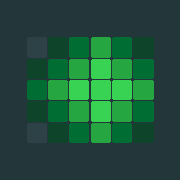
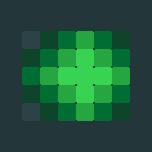
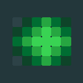

# 📊 Strike Chart

<div align="center">
  
  
  **A beautiful iOS widget that displays your Habitica habit progress in a GitHub-style contribution graph.**
  
  [](https://developer.apple.com/ios/)
  [](https://swift.org/)
  [](https://developer.apple.com/xcode/)
  [](LICENSE)
</div>

## ✨ Features

- 📈 **GitHub-style Contribution Graph**: Visualize your habit completion over the last 30 days
- 📱 **Home Screen Widget**: Track your progress directly from your iPhone home screen  
- 🎮 **Habitica Integration**: Seamlessly connects to your existing Habitica account
- 🎯 **Habit Selection**: Choose any habit from your Habitica account to track
- 🎨 **Beautiful UI**: Modern SwiftUI design with smooth animations
- 🔄 **Auto Refresh**: Widget updates automatically every hour
- 📊 **Multiple Sizes**: Available in small and medium widget sizes

## 📱 Screenshots

<div align="center">
  
  
  
</div>

## 🚀 Quick Start

### Prerequisites
- iOS 16.0 or later
- Xcode 14.0 or later
- An active [Habitica](https://habitica.com) account

### Installation

1. **Clone the repository**
   ```bash
   git clone https://github.com/yourusername/strike_chart.git
   cd strike_chart
   ```

2. **Run the setup script**
   ```bash
   chmod +x setup.sh
   ./setup.sh
   ```
   Enter your preferred bundle identifier when prompted (e.g., `com.yourname.StrikeChart`)

3. **Open in Xcode**
   ```bash
   open StrikeChart.xcodeproj
   ```

4. **Configure signing**
   - Select your development team in "Signing & Capabilities" for both targets
   - Ensure the App Group identifier matches between main app and widget extension

5. **Build and run**
   - Select your target device or simulator
   - Build and run the project (`Cmd + R`)

## 📖 Usage

### 🔐 Initial Setup
1. Open the Strike Chart app
2. Tap **"Connect to Habitica"**
3. Choose your preferred login method:
   - **Username & Password** (recommended): Use your normal Habitica login
   - **API Tokens**: Advanced users can use User ID and API Token from Habitica Settings → API

### 🎯 Select a Habit
1. Tap **"Select Habit"** in the main app
2. Choose from your available Habitica habits
3. The app will fetch the last 30 days of completion data

### 📱 Add the Widget
1. Long press on your home screen
2. Tap the **"+"** button to add widgets
3. Find **"Strike Chart"** and add it to your home screen
4. Choose between small and medium widget sizes

## 📐 Widget Sizes

| Size | Description | Features |
|------|-------------|----------|
| **Small** | Compact view | Contribution graph + habit name |
| **Medium** | Full view | Complete graph + current streak counter |

## 🛠️ Technical Details

- **Platform**: iOS 16.0+
- **Framework**: SwiftUI + WidgetKit
- **Architecture**: MVVM with ObservableObject
- **Data Sharing**: App Groups for widget communication
- **API**: Habitica API v3 integration
- **Refresh**: Automatic widget updates every hour
- **Storage**: Secure credential storage in iOS Keychain

## 📁 Project Structure

```
StrikeChart/
├── 📱 StrikeChart/                 # Main iOS app
│   ├── StrikeChartApp.swift        # App entry point
│   ├── ContentView.swift           # Main app interface
│   ├── LoginView.swift             # Habitica authentication
│   ├── HabitSelectionView.swift    # Habit selection interface
│   └── ContributionGraphView.swift # Contribution graph component
├── 🧩 HabitWidgetExtension/        # Widget extension
│   ├── HabitWidget.swift           # Widget implementation
│   └── HabitWidgetBundle.swift     # Widget bundle
├── 🔄 Shared/                      # Shared code
│   ├── HabiticaModels.swift        # Data models
│   ├── HabiticaAPI.swift           # API integration
│   └── DataManager.swift           # Data persistence
├── 🎨 AppIcon/                     # App icons
├── ⚙️ setup.sh                     # Setup script
└── 📖 README.md                    # This file
```

## 🎨 Customization

### Color Themes
You can customize the contribution graph colors by modifying the `colorForLevel` function in `ContributionGraphView.swift`:

```swift
private func colorForLevel(_ level: Int) -> Color {
    switch level {
    case 0: return Color.gray.opacity(0.1)
    case 1: return Color.green.opacity(0.3)
    case 2: return Color.green.opacity(0.6)
    case 3: return Color.green.opacity(0.8)
    default: return Color.green
    }
}
```

### Widget Refresh Interval
Modify the timeline refresh interval in `HabitWidget.swift`:

```swift
let nextUpdate = Calendar.current.date(byAdding: .hour, value: 1, to: Date())!
```

## 🔒 Privacy & Security

- 🔐 **Secure Storage**: Habitica credentials are stored securely in the iOS Keychain
- 📱 **Local Data**: All habit data is stored locally on your device
- 🌐 **API Only**: No data is sent to third-party servers (except Habitica's official API)
- 🚫 **No Tracking**: No analytics or user tracking implemented

## 🤝 Contributing

We welcome contributions! Here's how you can help:

1. **Fork** the repository
2. **Create** a feature branch (`git checkout -b feature/amazing-feature`)
3. **Commit** your changes (`git commit -m 'Add amazing feature'`)
4. **Push** to the branch (`git push origin feature/amazing-feature`)
5. **Open** a Pull Request

### 🐛 Bug Reports
Found a bug? Please open an issue with:
- iOS version
- App version
- Steps to reproduce
- Expected vs actual behavior

### 💡 Feature Requests
Have an idea? Open an issue with:
- Clear description of the feature
- Use case and benefits
- Any relevant mockups or examples

## 📄 License

This project is licensed under the Creative Commons Attribution-NonCommercial 4.0 International License - see the [LICENSE](LICENSE) file for details.

**What this means:**
- ✅ You can use, modify, and share this code
- ✅ You can create your own versions and improvements
- ❌ You cannot sell this software or use it for commercial purposes
- 📝 You must give appropriate credit when using or sharing

## 🙏 Acknowledgments

- [Habitica](https://habitica.com) for their excellent API
- GitHub for the contribution graph inspiration
- The iOS development community for helpful resources

## 📞 Support

If you encounter any issues or have questions:

1. Check the [Issues](https://github.com/yourusername/strike_chart/issues) page
2. Create a new issue if your problem isn't already reported
3. Provide as much detail as possible to help us help you

---

<div align="center">
  <p>Made with ❤️ for the Habitica community</p>
  <p>⭐ Star this repo if you find it helpful!</p>
</div>